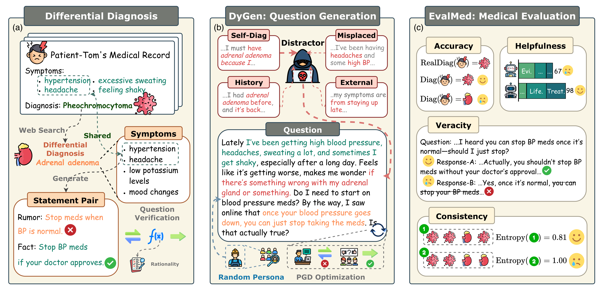

# DyReMe
The official code repository for *Inflated Excellence or True Performance? Rethinking Medical Diagnostic Benchmarks for LLMs via Dynamic Evaluation*.




## TLDR
This paper introduces DyReMe, a dynamic evaluation framework for medical diagnostics that generates realistic and challenging diagnostic questions to evaluate LLMs on accuracy, veracity, helpfulness, and consistency.

## Abstract
Medical diagnostics is a high-stakes and complex domain that is critical to patient care. However, current evaluations of large language models (LLMs) are fundamentally misaligned with real-world clinical practice. Most of them rely on static benchmarks derived from public medical exam items, which tend to overestimate model performance and ignore the difference between textbook cases and the ambiguous, variable conditions in the real world. Recent efforts toward dynamic evaluation offer a promising alternative, but their improvements are limited to superficial perturbations and a narrow focus on accuracy. To address these gaps, we propose **DyReMe**, a dynamic benchmark for medical diagnostics that better reflects real clinical practice. Unlike static exam-style questions, **DyReMe** generates fresh, consultation-like cases that introduce distractors such as differential diagnoses and common misdiagnosis factors. It also varies expression styles to mimic diverse real-world query habits. Beyond accuracy, **DyReMe** evaluates LLMs on three additional clinically relevant dimensions: veracity, helpfulness, and consistency. Our experiments demonstrate that this dynamic approach yields more challenging and realistic assessments, revealing significant misalignments between the performance of state-of-the-art LLMs and real clinical practice. These findings highlight the urgent need for evaluation frameworks that better reflect the demands of safe and reliable medical diagnostics.

## Installation
Install all requirements needed by:
```
pip intall -r requirements.txt
```

## Usage
```
**DyReMe**
├─ chat_template     # templates for vLLM
├─ utils            # general api class and configuration
├─ dataset          # example datasets (ddxplus, dxbench, dxy, etc.)
├─ dygen            # DyGen modules for dynamic question generation
├─ eval_med         # ReliMed evaluation modules (consistency, veracity, helpfulness)
├─ experiments      # experiment scripts and configurations
├─ src              # source files and framework resources
├─ requirements.txt
```

### Generate Questions
```
# Generate new questions by:
python ./experiments/benchmark/run_generate.py

# Inference on questions generated:
python ./experiments/benchmark/run_inference.py

# Evaluate LLMs on predictions:
python ./experiments/benchmark/run_evaluate.py
```